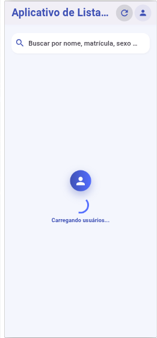
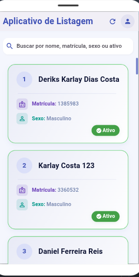
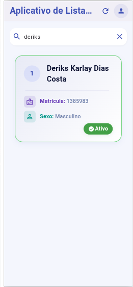
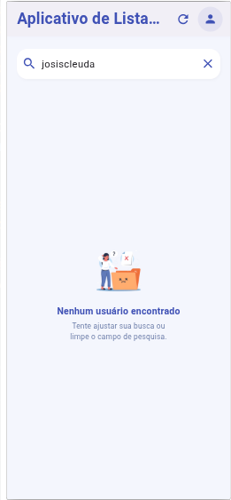

<div align="center">

# Flutter User List IFPA API

### Aplicativo Flutter para listagem, busca e filtragem de usuários consumindo uma API REST institucional
 

<br>


<br><br>

<p align="center">
  <a href="https://github.com/StellaKarolinaNunes/flutter-user-list-ifpa-api">
    
  </a>
  <a href="#preview">
    
  </a>
</p>

</div>

---

## Sobre o projeto

O **Flutter User List IFPA API** é uma aplicação desenvolvida em **Flutter** para consultar, listar, pesquisar e filtrar usuários a partir de uma API REST institucional.

O projeto foi desenvolvido como atividade avaliativa da disciplina de **Programação de Dispositivos Móveis**, com o objetivo de aplicar conceitos importantes do desenvolvimento mobile moderno, como consumo de APIs, requisições assíncronas, gerenciamento de estado, manipulação de listas, busca dinâmica, tratamento de erros e construção de interfaces responsivas.

A aplicação apresenta informações de usuários de forma organizada, permitindo realizar buscas por nome, matrícula, sexo e status, com atualização dinâmica da interface conforme os filtros aplicados.

> Este projeto possui finalidade acadêmica e utiliza uma API institucional restrita. Dados sensíveis, credenciais e endereços privados de API não devem ser enviados ao repositório.

---

## Objetivo

O objetivo principal é demonstrar como uma aplicação Flutter pode consumir dados de uma API externa e apresentar essas informações em uma interface clara, organizada e responsiva.

A proposta também reforça conhecimentos relacionados a:

* consumo de APIs REST;
* requisições HTTP assíncronas;
* gerenciamento de estado com Provider;
* tratamento de respostas JSON;
* filtragem dinâmica de listas;
* busca sem diferenciação entre letras maiúsculas e minúsculas;
* componentização de widgets;
* organização por camadas;
* experiência do usuário em aplicações mobile.

---

## Problema

Em ambientes acadêmicos e institucionais, encontrar informações específicas dentro de uma lista grande de usuários pode ser lento e pouco prático.

A consulta manual de nomes, matrículas ou informações de cadastro pode causar atrasos, dificuldade de navegação e maior chance de erro.

O projeto propõe uma interface de consulta que recebe os dados de uma API, organiza as informações visualmente e permite encontrar registros por meio de filtros e busca dinâmica.

---

## Solução desenvolvida

A solução utiliza Flutter como interface principal, Provider para gerenciamento de estado e uma camada de serviços responsável pela comunicação com a API REST.

Após receber os dados em formato JSON, a aplicação converte as informações para modelos Dart, atualiza a lista de usuários e permite filtrar os resultados sem recarregar toda a interface.

A estrutura foi organizada para separar responsabilidades entre telas, widgets, modelos, serviços, constantes e gerenciamento de estado.

---

## Funcionalidades

* **Listagem de Usuários:** exibição dinâmica de usuários obtidos por API REST.
* **Busca por Nome:** pesquisa de usuários de forma rápida e intuitiva.
* **Busca sem Diferenciação de Maiúsculas:** resultados encontrados independentemente de letras maiúsculas ou minúsculas.
* **Filtro por Matrícula:** localização de registros a partir da matrícula.
* **Filtro por Sexo:** filtragem de usuários conforme informações disponíveis na API.
* **Filtro por Status:** organização de registros a partir do status apresentado.
* **Atualização Manual:** botão para recarregar os dados recebidos pela API.
* **Indicador de Carregamento:** feedback visual durante requisições.
* **Tratamento de Erros:** mensagens para falhas de conexão, indisponibilidade ou respostas inválidas.
* **Estado Vazio:** interface específica para pesquisas sem resultado.
* **Scrollbar Personalizada:** melhoria na experiência de navegação em listas maiores.
* **Componentização:** widgets reutilizáveis para lista, cards, busca, erros e carregamento.
* **Interface Responsiva:** adaptação para diferentes resoluções e plataformas.
* **Gerenciamento de Estado:** atualização visual organizada por meio de Provider.

---

## Tecnologias utilizadas

| Tecnologia     | Aplicação no projeto                         |
| -------------- | -------------------------------------------- |
| Flutter        | Desenvolvimento da interface multiplataforma |
| Dart           | Linguagem principal da aplicação             |
| Provider       | Gerenciamento de estado                      |
| HTTP           | Comunicação com a API REST                   |
| JSON           | Estrutura de dados retornada pela API        |
| Flutter Dotenv | Leitura de configurações locais de ambiente  |
| Google Fonts   | Tipografia utilizada na interface            |
| Flutter SVG    | Renderização de imagens e ícones vetoriais   |
| Glassmorphism  | Elementos visuais com efeito translúcido     |
| Git            | Controle de versão                           |
| GitHub         | Hospedagem do repositório                    |

---

## Destaques técnicos

* Consumo de API REST com requisições assíncronas;
* Separação entre modelos, providers, serviços, widgets e telas;
* Gerenciamento de estado centralizado com Provider;
* Conversão de dados JSON para objetos Dart;
* Busca dinâmica sem distinção entre letras maiúsculas e minúsculas;
* Filtragem de usuários por diferentes critérios;
* Tratamento visual para carregamento, erro e lista vazia;
* Uso de variáveis de ambiente para evitar exposição da URL da API;
* Widgets reutilizáveis para cards, listas, busca e mensagens;
* Estrutura preparada para futuras melhorias, como paginação e cache local.

---

## Fluxo de funcionamento

```text
Aplicativo iniciado
        │
        ▼
Provider solicita os dados ao serviço de API
        │
        ▼
Requisição HTTP enviada para a API institucional
        │
        ▼
Resposta recebida em formato JSON
        │
        ▼
Dados convertidos para modelos Dart
        │
        ▼
Lista de usuários exibida na interface
        │
        ├── Busca por nome
        ├── Filtro por matrícula
        ├── Filtro por sexo
        └── Filtro por status
        │
        ▼
Interface atualizada conforme os filtros aplicados
```

---

## Preview

<div align="center">

| Carregamento                                                                          | Listagem de usuários                                                                        | Busca dinâmica                                                                         | Sem resultados                                                                                |
| ------------------------------------------------------------------------------------- | ------------------------------------------------------------------------------------------- | -------------------------------------------------------------------------------------- | --------------------------------------------------------------------------------------------- |
|  |  |  |  |

</div>

> As imagens são ilustrativas. Informações sensíveis, dados pessoais e credenciais de acesso foram ocultados para preservar a privacidade dos usuários.

---

## Estrutura do projeto

```bash
flutter-user-list-ifpa-api/
├── assets/
│   └── imagens/
│       ├── banner.png
│       ├── carregamento.png
│       ├── home.png
│       ├── pesquisa.png
│       └── sem_busca.png
│
├── lib/
│   ├── constants/
│   │   ├── app_colors.dart
│   │   ├── app_fonts.dart
│   │   └── app_icon.dart
│   │
│   ├── models/
│   │   └── usuario.dart
│   │
│   ├── providers/
│   │   └── usuario_provider.dart
│   │
│   ├── screens/
│   │   └── home_screen.dart
│   │
│   ├── services/
│   │   └── api_service.dart
│   │
│   ├── widgets/
│   │   ├── custom_scrollbar.dart
│   │   ├── error_widget.dart
│   │   ├── loading_widget.dart
│   │   ├── no_results_widget.dart
│   │   ├── search_field.dart
│   │   ├── usuario_card.dart
│   │   └── usuario_list.dart
│   │
│   └── main.dart
│
├── test/
│   ├── unit_test.dart
│   └── widget_test.dart
│
├── .env.example
├── analysis_options.yaml
├── CONTRIBUTING.md
├── LICENSE
├── pubspec.yaml
├── pubspec.lock
└── README.md
```

> Pastas e arquivos gerados automaticamente pelo Flutter, como `build/`, `.dart_tool/` e configurações locais `.env`, não devem ser versionados no Git.

---

## Como executar o projeto

### Pré-requisitos

Antes de iniciar, é necessário ter instalado:

* Flutter SDK;
* Dart SDK compatível com a versão do Flutter;
* Git;
* Android Studio ou VS Code;
* Extensões Flutter e Dart instaladas no editor;
* Emulador Android configurado, dispositivo físico conectado ou navegador compatível;
* Credenciais ou URL autorizada para acesso à API institucional.

### 1. Clone o repositório

```bash
git clone https://github.com/StellaKarolinaNunes/flutter-user-list-ifpa-api.git
```

### 2. Acesse a pasta do projeto

```bash
cd flutter-user-list-ifpa-api
```

### 3. Verifique o ambiente Flutter

```bash
flutter doctor
```

### 4. Crie o arquivo de ambiente

Crie um arquivo `.env` a partir do modelo disponível:

```bash
cp .env.example .env
```

No Windows, você pode copiar manualmente o arquivo `.env.example` e renomeá-lo para `.env`.

### 5. Configure a URL da API

Adicione no arquivo `.env` uma URL válida e autorizada:

```env
API_URL=https://sua-api-autorizada.exemplo
```

> Não envie o arquivo `.env` para o GitHub. Ele pode conter URLs privadas, tokens ou informações institucionais sensíveis.

### 6. Instale as dependências

```bash
flutter pub get
```

### 7. Execute o aplicativo

```bash
flutter run
```

Para executar no navegador:

```bash
flutter run -d chrome
```

Para visualizar os dispositivos disponíveis:

```bash
flutter devices
```

---

## Testes

Para executar todos os testes:

```bash
flutter test
```

Para executar testes de widgets:

```bash
flutter test test/widget_test.dart
```

Para analisar possíveis problemas de código:

```bash
flutter analyze
```

---

## Roadmap

### Estrutura e integração

* [x] Configuração inicial do projeto Flutter;
* [x] Organização por constantes, modelos, providers, serviços e widgets;
* [x] Integração com API REST institucional;
* [x] Conversão de dados JSON para modelos Dart;
* [x] Gerenciamento de estado com Provider;
* [x] Listagem dinâmica de usuários;
* [x] Atualização manual dos dados;
* [x] Tratamento de carregamento e erros.

### Busca e filtros

* [x] Busca por nome;
* [x] Busca sem diferenciação entre letras maiúsculas e minúsculas;
* [x] Filtragem por matrícula;
* [x] Filtragem por sexo;
* [x] Filtragem por status;
* [x] Mensagem para pesquisa sem resultados;
* [ ] Paginação para listas grandes;
* [ ] Filtros combinados avançados;
* [ ] Ordenação por nome ou matrícula;
* [ ] Pesquisa por múltiplos campos simultaneamente.

### Experiência e qualidade

* [x] Interface responsiva;
* [x] Widgets reutilizáveis;
* [x] Scrollbar personalizada;
* [x] Feedback visual de carregamento;
* [ ] Efeito shimmer durante carregamento;
* [ ] Melhorias de acessibilidade;
* [ ] Melhorias para leitores de tela;
* [ ] Tema claro e escuro;
* [ ] Cache local para funcionamento parcial offline.

### Próximos passos

* [ ] Tela detalhada de usuário;
* [ ] Persistência local com SQLite ou Hive;
* [ ] Atualização automática de dados;
* [ ] Exportação de lista filtrada;
* [ ] Paginação via API;
* [ ] Testes unitários mais completos;
* [ ] Testes de integração;
* [ ] Geração de APK e App Bundle para produção.

---

## Contribuição

Contribuições são bem-vindas e ajudam a tornar o projeto mais organizado, seguro e útil para fins acadêmicos.

### Processo de contribuição

```bash
# Faça um fork do repositório no GitHub

# Clone o seu fork
git clone https://github.com/SEU-USUARIO/flutter-user-list-ifpa-api.git

# Entre na pasta do projeto
cd flutter-user-list-ifpa-api

# Crie uma branch para sua funcionalidade
git checkout -b feature/nova-funcionalidade

# Instale as dependências
flutter pub get

# Execute os testes
flutter test

# Adicione as alterações
git add .

# Crie um commit descritivo
git commit -m "feat: adiciona nova funcionalidade"

# Envie a branch para o GitHub
git push origin feature/nova-funcionalidade
```

Depois, abra um Pull Request explicando de forma clara:

* qual problema foi resolvido;
* quais arquivos foram alterados;
* como a funcionalidade foi testada;
* se houve alteração de interface;
* se existem impactos em integração com a API.

### Diretrizes

* Mantenha o código organizado, legível e reutilizável;
* Preserve a separação entre widgets, providers, serviços e modelos;
* Utilize nomes claros para variáveis, métodos e classes;
* Evite incluir lógica de API diretamente nas telas;
* Não envie URLs privadas, tokens, senhas ou dados institucionais;
* Não adicione dados reais de alunos ao repositório;
* Teste as funcionalidades antes de abrir um Pull Request;
* Atualize o README quando houver mudança importante;
* Preserve o padrão visual e a responsividade existentes.

---

## Licença

Este projeto está licenciado sob a [Licença MIT](LICENSE).

```text
MIT License

Você pode usar, modificar e distribuir este projeto,
desde que mantenha os créditos e a referência ao repositório original.
```

---

## Créditos

### Desenvolvimento e contexto acadêmico

* **Desenvolvimento principal:** [Stella Karolina Nunes](https://github.com/StellaKarolinaNunes)
* **Desenvolvimento:** [João Gabriel Peres de Castro](https://github.com/Gab0701)
* **Instituição:** Instituto Federal de Educação, Ciência e Tecnologia do Pará — IFPA
* **Curso:** Bacharelado em Ciência da Computação
* **Disciplina:** Programação de Dispositivos Móveis
* **Professor orientador:** [Deriks Karlay Dias Costa](https://github.com/karlaycosta)

### Tecnologias e recursos

* **Framework:** [Flutter](https://flutter.dev/)
* **Linguagem:** [Dart](https://dart.dev/)
* **Gerenciamento de estado:** [Provider](https://pub.dev/packages/provider)
* **Requisições HTTP:** [http](https://pub.dev/packages/http)
* **Variáveis de ambiente:** [flutter_dotenv](https://pub.dev/packages/flutter_dotenv)
* **Tipografia:** [Google Fonts](https://pub.dev/packages/google_fonts)
* **Ícones e vetores:** [Flutter SVG](https://pub.dev/packages/flutter_svg)
* **Efeitos visuais:** [Glassmorphism](https://pub.dev/packages/glassmorphism)
* **Controle de versão:** Git e GitHub
* **Badges:** [Shields.io](https://shields.io/)
